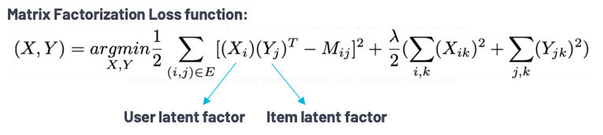
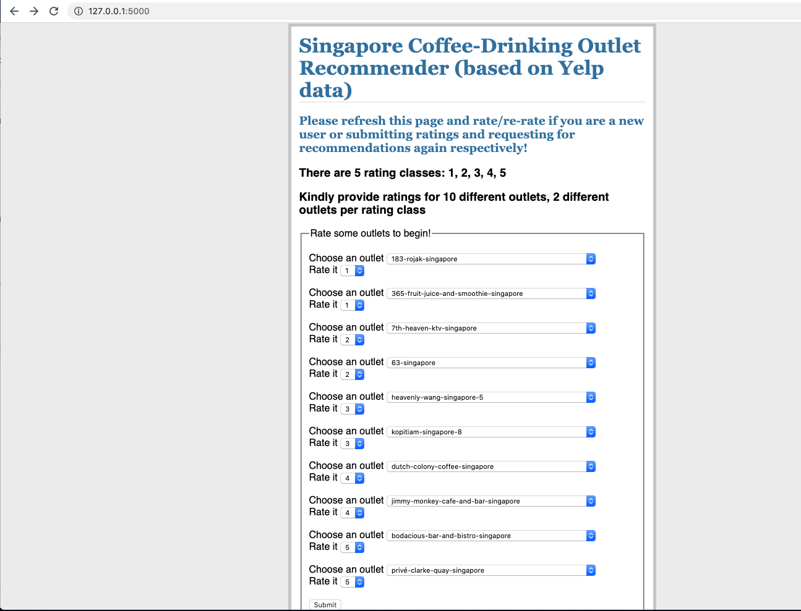
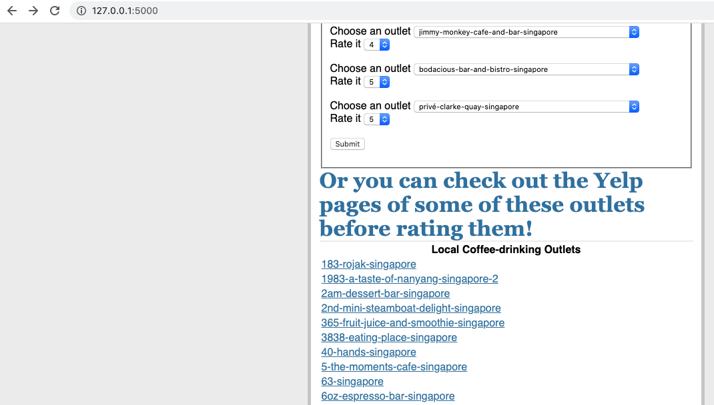
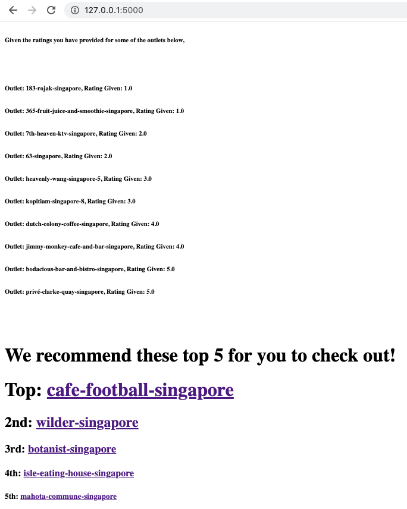
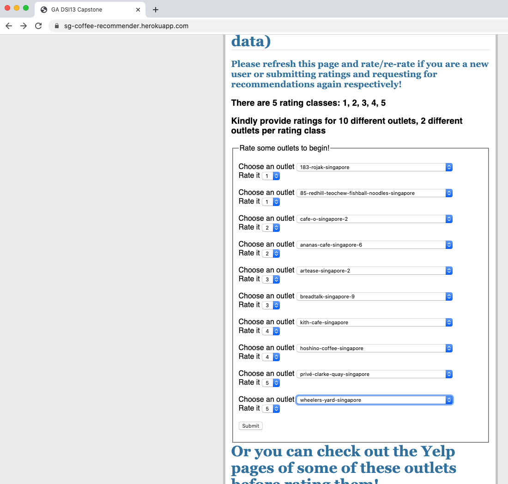
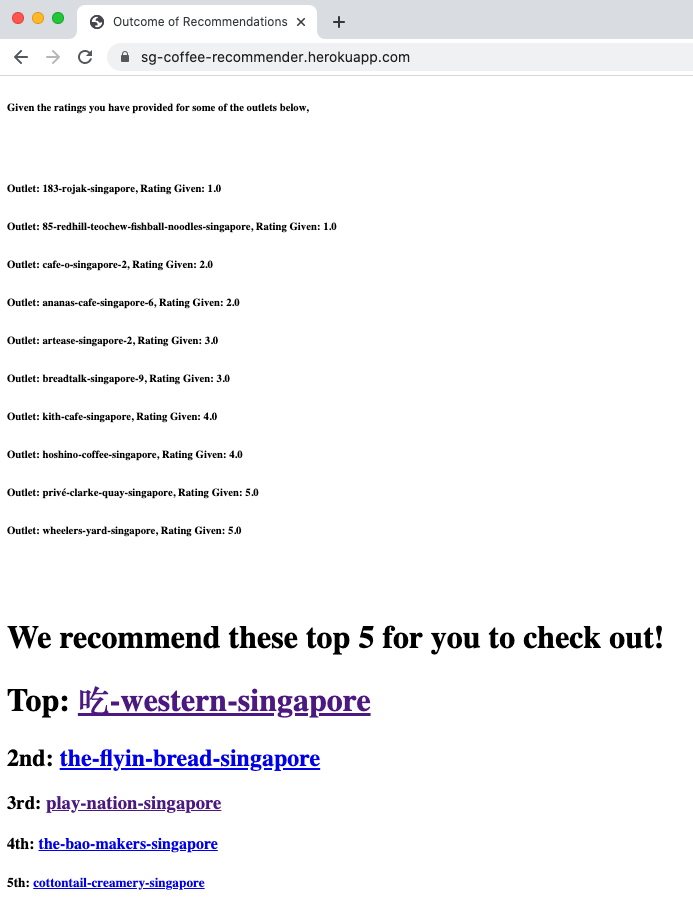
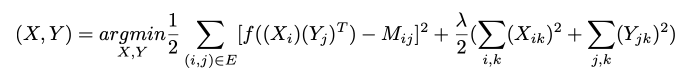

# Capstone Project: Recommender for Local Coffee-Drinking Places
- (Data obtained from Yelp)
- (Author: Mr Jason Chia)
---

## Background and Business Problem
---

<ul>

- It is ever more challenging nowadays to decide on a prime spot for one's favorite cuppa coffee against the backdrop of a burgeoning food and beverage industry (FnB). With the younger generation rising to the occasion in recent years, we are seeing an increasing number of artisanal and creative FnB outlets, touting all sorts of innovative menu items that render the typical coffee consumers like you utterly spoilt for choice! Beyond these new up-and-coming outfits, don't forget the idyllic, quaint but ultimately good testaments to quality coffee such as traditional hawker centres and foodcourts - there are definitely more than one too many options for coffee-drinkers who prefer to pander to old times and nostalgia too!
 
</ul>

---

## Overview of Recommendation Systems and Project Objective
---

<ul>
    
- Therefore, I am taking it upon myself to make your life that much easier by building a recommendation system that will recommend you coffee-drinking places based on reviews and ratings! So instead of poring over all outlets' reviews and checking out their individual ratings on Yelp one by one until one reaches the 1000th outlet before deciding which to settle for, users can potentially just rate a couple that they have been to before, click another button, and BAM!...Out comes the top 5 recommendations you can check out right away!
    
</ul>

<ul>
    
- Types of recommendation systems include Collaborative Filtering - where a user's preferences are predicted from other similar users' and hence, the collaborative aspect, and ranking preference predictions in the form of rating predictions for example, to generate recommendations - and Content-based Filtering - where a user is recommended items similar in terms of item characteristics such as item category to the items once liked or rated highly by user. Collaborative Filtering allows the possibility of cross-recommendations - where items dissimilar to an item once liked or rated highly by user could be recommended to user based on high ratings by other users of similar tastes - but faces the cold-start problem - hard to predict preferences of new users who have never rating anything before or recommend new items that have not been rated before by users. Collaborative Filtering can be sub-divided further into Memory-based and Model-based. Memory-based Collaborative Filtering is purely based on determining similarities between different users' preferences based on past users' rating patterns using some form of pairwise distance metric such as Jaccard distance metric or cosine similarity, while Model-based Collaborative Filtering relies upon an algorithm to model user-item interactions and thus has slightly higher bias but will generalize better to out-of-sample data and hence have lower variance. An example of a model-based collaborative filtering algorithm is the Alternating Least Squares (ALS) algorithm which is a matrix factorization technique that decomposes user-item interaction matrix (such as user-item ratings matrix for datasets with explicit feedback) into user and item latent factors where their dot product will predict user ratings. It alternates between fixing user or item latent factors to solve for the other via gradient descent at each iteration in the process of minimizing loss: 

</ul>



<ul>
    
- As ALS will be imported from a ```pyspark``` machine learning library, please follow specific instructions at the top of notebook Parts 7 and 9 to download and install the necessary libraries and dependencies pertaining to java, scala, spark and pyspark, as well as follow the instructions on how to configure the software in order to avoid encountering errors when running ```pyspark```-related code in some of the notebooks.

</ul>

<ul>
    

- ***KINDLY NOTE THAT IF YOU HAVE ENCOUNTERED A CONNECTION REFUSED ERROR OR A JAVA ERROR WHERE IT IS TRYING TO CONNECT TO YOUR IP ADDRESS BUT FAILED WHEN RUNNING ANY PYSPARK-RELATED CELL, KINDLY JUST COPY ALL THE CELLS IN THE NOTEBOOK (HIGHLIGHT THE TOP CELL AND CMD(FOR MAC)/CTRL(FOR WINDOWS) + SHIFT + HIGHLIGHT THE LAST CELL), COPY AND PASTE INTO A FRESH NOTEBOOK AND RUN THEM THERE INSTEAD***
    
</ul>

<ul>    
     
- User-centered Content-based Filtering is about building a model for each user that predicts that user's rating for all the different items based on characteristics of the various items such as item category, item review count etc., in the process, learning that user's coefficients. A potential shortfall of Content-based Filtering is that it is unlikely to provide cross-recommendations - something that can be compensated by Collaborative Filtering in a hybrid recommendation system which will be what I will be building in this project, albeit a simple version...
    
</ul>

<ul>
    
- Ideally, there should be one model built for each user in content-based filtering but for the purpose of a simple demonstration in this capstone project of 6-7 weeks, I will only be building and tuning one model for the user-centered content-based filtering component for the hybrid system for a sample user (userid 2043) who happened to have rated a vast majority of the coffee-drinking outlets contained within the dataset to be used for this project. Now this could potentially introduce bias since the content-based model will only be representative of this particular user's taste and preferences but we will see later on that's where a hybrid recommendation system's value shines through, with the collaborative filtering component compensating for this bias since it takes into account other similar users' ratings.
    
</ul>

<ul>
    
- Beyond the capstone presentation, more work was done - in particular, XGB Classifier was properly tuned and trained on not just one prominent userid (i.e. userid 2043) but on 110 of them (chosen as they had rated at least 10 outlets, where 10 was an arbitrary number which should avoid errors at the train_test_split stage where the split would be stratified by userids instead, and cross-validation stage). In addition, ALS was also re-tuned on datasets split with stratification for userids instead. The new outcomes generated exceeded the performance of earlier models chosen in this capstone project. More details on the work done beyond the capstone presentation can be found in the various alternative notebooks in the repo.

---

## Approach
---

<ul>
    
- Data scraping: The data is a list of 987 coffee drinking places in Singapore scraped using Yelp's api token, 6,292 reviews, 7,076 ratings and userids of reviews scraped using BeautifulSoup from Yelp's website. (details inside Part 1 notebook)
    
</ul>

<ul>
    
- Data Cleaning, Feature Engineering, Preprocessing, Exploratory Data Analysis (EDA) and generation of other datasets for manipulation in subsequent notebooks (details inside Part 1 notebook or alternate notebook)
    
</ul>

<ul>
    
- Content-based Filtering and Evaluation (Micro-Average Precision, Recall, F1, ROC AUC, and Prevalence-Weighted ROC AUC)(details inside Parts 2 - 6 notebooks):
    
    <ol>
        <li>
            Modeling with Logistic Regression and Tfidf vectorization
        </li>
        <li>
            Modeling with Logistic Regression and Tfidf vectorization and PCA
        </li>
        <li>
            Modeling with Decision Tree Classifier and Tfidf vectorization
        </li>
        <li>
            Modeling with XGB Classifier and Tfidf vectorization (performed best)
        </li>
        <li>
            Modeling with Decision Tree Classifier and Tfidf vectorization and PCA
        </li>
        <li>
            Modeling with Random Forest Classifier and Tfidf vectorization
        </li>
    </ol>
    
</ul>

<ul>
    
- Collaborative Filtering with ALS and Evaluation (Micro-Average Precision, Recall, F1) (details inside Part 7 notebook or alternate notebook)
    
</ul>

<ul>
    
- Hybrid Recommendation System Evaluation (Micro-Average Precision, Recall, F1) (details inside Part 8 notebook or alternate notebook)
    
    <ol>
        <li>
            Combination of Content-based and Collaborative Filtering by taking weighted sum of ratings from both as the final rating predictions
        </li>
    </ol>

</ul>

<ul>
    
- Simple Trial of Hybrid Recommendation System : 10 arbitrary ratings will be fed into the system to see if it works to churn out discernible recommendations (details inside Part 9 notebook)
    
</ul>

<ul>
    
- Model Improvements and Current Limitations (details inside Part 9 notebook)
    
</ul>
 
<ul>
    
- Conclusions and Future Plans (details inside Part 9 notebook)
    
</ul>

---

## Models' Summary
---


<ul>

- <font size='3'>__Content-based Filtering (baseline accuracy: 0.48)__</font>:
    
    </ul>

|<center><font size='2'>Model<center>|<center><font size='2'>Accuracy<center>|<center><font size='2'>Micro-Average<br>Precision<center>|<center><font size='2'>Micro-Average<br>Recall<center>|<center><font size='2'>Micro-Average<br>$F_1$ score<center>|<center><font size='2'>Micro-Average<br>ROC AUC<center>|<center><font size='2'>Prevalence-Weighted<br>ROC AUC<center>|
|---|---|---|---|---|---|---|
|<center><font size='1'>*Logistic Regression<br>with<br>TfidfVectorizer*<center>|<center>0.81<center>|<center>0.81<center>|<center>0.81<center>|<center>0.81<center>|<center>0.88<center>|<center>0.71<center>|
|<center><font size='1'>*Logistic Regression<br>with<br>TfidfVectorizer<br>with<br>PCA*<center>|<center>0.50<center>|<center>0.50<center>|<center>0.50<center>|<center>0.50<center>|<center>0.65<center>|<center>0.57<center>|
|<center><font size='1'>Decision Tree Classifier<br>with<br>TfidfVectorizer<center>|<center>0.85<center>|<center>0.85<center>|<center>0.85<center>|<center>0.85<center>|<center>0.94<center>|<center>0.90<center>|
|<center><font size='1'>***XGB Classifier<br>with<br>TfidfVectorizer (chosen)***<center>|<center>***0.97***<center>|<center>***0.97***<center>|<center>***0.97***<center>|<center>***0.97***<center>|<center>***1.0***<center>|<center>***1.0***<center>|
|<center><font size='1'>*Decision Tree Classifier<br>with<br>TfidfVectorizer<br>with<br>PCA*<center>|<center>0.43<center>|<center>0.43<center>|<center>0.43<center>|<center>0.43<center>|<center>0.62<center>|<center>0.47<center>|
|<center><font size='1'>*Random Forest Classifier<br>with<br>TfidfVectorizer*<center>|<center>0.61<center>|<center>0.61<center>|<center>0.61<center>|<center>0.61<center>|<center>0.92<center>|<center>0.81<center>|

<ul>
    
- <font size='3'>__Model-based Collaborative Filtering (baseline accuracy: 0.47)__</font>:
    
    </ul>

|<center><font size='2'>Model<center>|<center><font size='2'>Accuracy<center>|<center><font size='2'>Micro-Average<br>Precision<center>|<center><font size='2'>Micro-Average<br>Recall<center>|<center><font size='2'>Micro-Average<br>$F_1$ score<center>|
|---|---|---|---|---|
|<center><font size='1'>*Alternating Least Squares (ALS)*<center>|<center>1.0<center>|<center>1.0<center>|<center>1.0<center>|<center>1.0<center>|
    
<ul>
    
- <font size='3'>__Hybrid Recommender (baseline accuracy: 0.48)__</font>:
    
    </ul>

|<center><font size='2'>Model<center>|<center><font size='2'>Accuracy<center>|<center><font size='2'>Micro-Average<br>Precision<center>|<center><font size='2'>Micro-Average<br>Recall<center>|<center><font size='2'>Micro-Average<br>$F_1$ score<center>|
|---|---|---|---|---|
|<center><font size='1'>*Hybrid Recommender<br>(ALS and XGB Classifier)*<center>|<center>1.0<center>|<center>1.0<center>|<center>1.0<center>|<center>1.0<center>|
    
---

## Flask Implementation and Heroku Deployment
---

<ul>
    
- Flask Implementation (Hybrid Recommender)
    <ul>
        - The main project folder is "flaskr". Within it lies the python script - flaskr.py - that runs the app.
    </ul>

</ul>
    



    
<ul>
    
- Heroku Deployment (Content-based Filtering Recommender only)
    <ul>
        - The Procfile, requirements.txt, and runtime.txt are for Heroku deployment of the content-based filtering using XGB Classifier.
    </ul>

</ul>
    



<ul>    
    
- Built a Flask app with this hybrid recommendation system and it was implemented successfully in a local virtual environment as shown below (screenshots). However, it takes on average 15 mins or more for the recommendations to be generated... Regarding the actual deployment on a platform like Heroku, as the pyspark component is a lot more intractable and there are very few, if not no resources online on deployment of pyspark apps on Heroku, I was not able to deploy the full hybrid recommendation system and wound up only deploying the XGB Classifier-supported content-based filtering component (further screenshots below). Please click [here](http://sg-coffee-recommender.herokuapp.com/) for the link to the content-based filtering deployed on Heroku. 
    
</ul>

    
---
    
## Model Improvements and Current Limitations
---
    
<ul>
    
    
- The major limitation with the earlier phase of the project was that the content-based filtering was trained and tuned on only a single userid's ratings which may not be representative of the vast majority even though said userid rated a considerable number of outlets... In this extension, the content-based filtering was not only trained on more than 1 userid (110 to be precise), but time was spent tuning an XGB Classifier algorithm properly in an attempt to mitigate this under-representation issue. This time round, training data was restricted arbitrarily to those who have rated at least 10 outlets (only 110 userids out of 2552; the rest rated less than 10 outlets - quite a significant number rated only 1-2 outlets and including them will make the train_test_split and cross-validation aspect of the project problematic since it is important to stratify the splitting by userids in the evaluation stage).
<ul>
    - Indeed, the XGB Classifier did not disappoint, with a near-perfect scores of 0.97 - 1.0 in its performance.
    </ul>
    
</ul>

<ul>    
    
- ALS is a regressor, output was “tweaked” for classification to align with Content-based Filtering --> some predicted ratings fell into novel classes - possible way to improve is incorporate logistic/sigmoid function (f(x)) to automatically convert continuous predicted ratings to discrete rating classes that line up with actual ratings' classes:

</ul>

   
    



    
<ul>

- The above extension of matrix factorization can then be adapted and extended to more complex algorithms like neural networks, which are used for near state-of-the-art recommenders.
    
</ul>
    
<ul>
    
- This project only uses explicit user ratings for coffee-drinking outlets in Singapore. Perhaps can consider sourcing for and including implicit data such as clickthroughs and page views to further enhance the hybrid recommender...

</ul>

<ul>
    
- TfidfVectorizer and PCA not tuned: Hard to tune TfidfVectorizer as input features for Content-based Filtering are not just a single reviews' column but also combined with numerical features and so it is impossible to tune it in a pipeline together with an estimator without separating the dataset into reviews and numerical features, which complicates the process; but PCA could be tuned further for more promising results as the first iteration suggests that the grid search space could be modified further
    
</ul>
    
<ul>    
    
- Mean Normalization of ratings could be considered so that hybrid system can fall back on mean outlet ratings to rank recommendations for new users who do not provide ratings (in a way dealing with cold start problem of collaborative filtering)
    
</ul>
    
<ul>
    
- Scraped data quality (a few ratings and userids not aligned --> affects quality of recommendations)

</ul>
    
<ul>
    
- Lastly, this dataset is static and any deployed app will need to be updated regularly to remain relevant...
    
</ul>
---

## Conclusions and Future Plans
---
    
<ul>
    
- Potentially tune PCA or Tfidf to further boost content-based filtering performance
    
</ul>
    
<ul>
    
- Long Term Steps:
    
   <ol>
       <li>
          - Will keep a lookout for updates on the various deployment platforms, stackoverflow, and pyspark deployment to see if the pyspark ALS component can be incorporated into the deployment without incurring unnecessary billing, as tapping onto the [AWS S3 Bucketeer](https://elements.heroku.com/addons/bucketeer) that complements deployment of spark applications on Heroku is not complimentary.
       </li>
    </ol>
    
</ul>

## Source(s)
    
- https://www.kaggle.com/gspmoreira/recommender-systems-in-python-101
- https://towardsdatascience.com/introduction-to-recommender-systems-6c66cf15ada
- https://stackoverflow.com/questions/39685740/calculate-sklearn-roc-auc-score-for-multi-class
- https://medium.com/luckspark/installing-spark-2-3-0-on-macos-high-sierra-276a127b8b85
- https://towardsdatascience.com/creating-a-hybrid-content-collaborative-movie-recommender-using-deep-learning-cc8b431618af
- https://towardsdatascience.com/prototyping-a-recommender-system-step-by-step-part-1-knn-item-based-collaborative-filtering-637969614ea
- https://www.coursera.org/lecture/machine-learning/implementational-detail-mean-normalization-Adk8G
- http://sg-coffee-recommender.herokuapp.com/
- https://elements.heroku.com/addons/bucketeer


